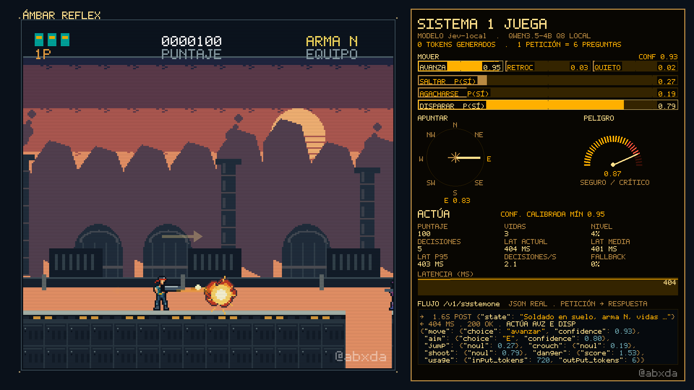

# Sistema 1 juega — decisiones tipadas locales (compatibles con Jev) jugando un run-and-gun ochentero



*Partida real `rt-D-1987-2`, 2.3 s de juego: la decisión llega con confianza 0.95 (ACTÚA) y el comando dispara al frente. A la derecha, el flujo JSON de la llamada.*

Un modelo de lenguaje de 4B **que no genera texto** juega en tiempo real **Ámbar Reflex**, un run-and-gun
original de estilo 8 bits.

- En cada decisión recibe una descripción compacta del frame y **6 preguntas cerradas en una sola
  petición**: mover, saltar, agacharse, apuntar, disparar y peligro.
- Devuelve **probabilidades**. Las sirve un servidor local compatible con la API de Jev (TypeSafe AI),
  sobre Qwen3.5-4B Q8_0 en una RTX 3060.

Autoría: **@abxda**.

| Quién juega | Avance medio | Latencia por decisión |
|---|--:|--:|
| Sistema 1 (decisiones tipadas), tiempo real, N=5 | **24.9 %** | **408 ms** |
| Sistema 2 (mismo tamaño, escribiendo JSON), tiempo real, N=3 | 10.3 % | 1041 ms |
| Agente aleatorio, N=5 | 4.6 % | — |

«El formato está garantizado; la corrección no.» Detalle en
[`sistema1-juega/results.md`](sistema1-juega/results.md). Videos en `sistema1-juega/video/`.

## ¿Quién decide mejor? Tres modelos, la misma partida

El juego también sirve como **benchmark en video para contrastar modelos**. Tres modelos abiertos, sin
pensamiento, juegan la misma partida con las mismas preguntas y el mismo servidor compatible con Jev
([`sistema1-juega/results_modelos.md`](sistema1-juega/results_modelos.md)):

| Modelo | Exactitud en 554 decisiones (sin presión de tiempo) | Avance en tiempo real | Latencia por decisión |
|---|--:|--:|--:|
| Qwen3.5-4B (Q8_0) | 77.8 % | **24.9 %** | 408 ms |
| Gemma 4 E4B (Q6_K) | 81.6 % | 14.4 % | **312 ms** |
| Qwen3.5-9B (Q5_K_M) | **82.7 %** | 17.5 % | 591 ms |

El más listo sin presión de tiempo (9B) no es el que llega más lejos jugando (4B). En tiempo real pesan
la velocidad, la puntería y los sesgos por pregunta; Gemma, por ejemplo, salta en el 74 % de
las decisiones. Salvedad: las preguntas se afinaron con el 4B, que juega de local.

Videos: `sistema1-juega/video/comparacion_modelos_vertical_1080x1920.mp4` (en pila) y
`comparacion_modelos_horizontal_1920x1080.mp4` (lado a lado). Si un modelo muere, su pantalla queda
congelada en «GAME OVER» mientras los demás siguen.

## Contenido

| Carpeta / archivo | Qué es |
|---|---|
| [`JEV_LOCAL_REPORTE.md`](JEV_LOCAL_REPORTE.md) | Qué es Jev, emuladores ordenados por JevBench y por qué elegimos SemIf sobre Qwen3.5-4B |
| [`jevlocal/`](jevlocal/) | Servidor `POST /v1/systemone` y `GET /v1/models` (API de Jev): motor llama.cpp con árbol de secuencias, empaquetado portátil, benchmarks |
| [`results/`](results/) | Evaluaciones del motor (exactitud y calibración en 554 decisiones etiquetadas; latencias) |
| [`sistema1-juega/`](sistema1-juega/) | Juego, agente, oráculo, benchmark, logs de todas las partidas, figuras, videos, `results.md`, `social.md` |
| [`REGENERAR_VIDEOS.md`](REGENERAR_VIDEOS.md) | Regenerar **idénticos** los videos de la mejor partida (sin GPU) |
| [`ARQUITECTURA_GRAFICA.md`](ARQUITECTURA_GRAFICA.md) | Arquitectura del render, para rediseñar y regenerar los videos |

**No incluidos** (por tamaño o licencia; se descargan o reconstruyen):
- los pesos GGUF;
- el wheel CUDA y el paquete portátil de 5.8 GB;
- los clones de SemIf y reflex;
- los datos de evaluación de terceros.

## Replicar

### A. Solo regenerar los videos desde los logs (cualquier Linux, sin GPU)
```bash
git clone https://github.com/abxda/ambar-reflex-sistema-1.git && cd ambar-reflex-sistema-1/sistema1-juega
make setup                      # requiere uv y ffmpeg con libx264/aac
make test                       # 10 pruebas: esquema, determinismo, repetición == logs, consistencia de cifras
.venv/bin/python -m bench.make_videos --run runs/bench/realtime/rt-D-1987-2
```
Ver [`REGENERAR_VIDEOS.md`](REGENERAR_VIDEOS.md) (MD5 esperados) y
[`ARQUITECTURA_GRAFICA.md`](ARQUITECTURA_GRAFICA.md) (rediseño).

### B. Levantar el servidor System One (GPU NVIDIA ≥ 8 GB, driver ≥ 570)
```bash
# 1) wheel CUDA de llama-cpp-python 0.3.35 (gcc 13 + CUDA 12.8 de conda-forge; glibc 2.28)
jevlocal/packaging/build_wheel.sh                # necesita conda y uv; ~6 min con 32 núcleos
# 2) venv del servidor
uv venv -p 3.12 .venv-jl
uv pip install -p .venv-jl/bin/python build/dist228/llama_cpp_python-0.3.35-*.whl -e jevlocal
# 3) modelo (4.6 GB)
uvx --from huggingface_hub hf download bartowski/Qwen_Qwen3.5-4B-GGUF Qwen_Qwen3.5-4B-Q8_0.gguf --local-dir models/gguf
# 4) servidor en http://127.0.0.1:8765 (reduce ramas y contexto solo si la GPU también dibuja pantalla)
.venv-jl/bin/jevlocal selftest
.venv-jl/bin/jevlocal serve
```
El SDK oficial de TypeSafe funciona sin cambios con `TYPESAFE_BASE_URL=http://127.0.0.1:8765`.
Para crear un paquete autocontenido y llevarlo a otra máquina: `jevlocal/packaging/build_package.sh`.

### C. Repetir el benchmark completo
```bash
cd sistema1-juega
bench/server.sh start && export JEV_BASE_URL=http://127.0.0.1:8765
make benchmark        # calibración, variantes, N=5 tiempo real, turnos, aleatorio, concurrencia, reporte, videos
make human            # línea base humana (teclado); repetir 5 veces
bench/server.sh stop && make system2      # opcional: Sistema 2 con Ollama qwen3.5:4b
```

> ⚠️ **Seguridad de GPU.** Si la GPU también dibuja el escritorio, una carga sostenida puede congelarlo.
> Nos pasó (NVRM Xid 56). El proyecto trae defaults seguros y un watchdog (`sistema1-juega/bench/gpu_guard.py`)
> que aborta ante errores Xid, más de 80 °C o poca VRAM libre. Corre una partida a la vez.

## Licencia
[MIT](LICENSE) © 2026 abxda. Los pesos del modelo (no incluidos) conservan su propia licencia (Apache-2.0).

## Créditos
- **Construido con:** Claude Opus 5.5 (arquitectura, código, benchmark y análisis) y GPT-6 Astra
  (diseño gráfico del juego), bajo la dirección del Dr. Coronado (@abxda).
- **Método de lectura de logits:** [SemIf](https://github.com/TheoLeeCJ/SemIf) (MIT). **Perfil de prompt
  markdown:** [reflex](https://github.com/kshetrajna12/reflex) (MIT).
- **Modelo:** Qwen3.5-4B (Qwen, Apache-2.0), GGUF de bartowski. Motor: llama.cpp / llama-cpp-python (MIT).
- **API:** compatible con Jev de [TypeSafe AI](https://docs.typesafe.ai/api). Este proyecto no está
  afiliado a TypeSafe.
- **El juego:** homenaje original. Todos los assets (pixel art, fuente, música) se generan por código en
  este repositorio.

— @abxda
