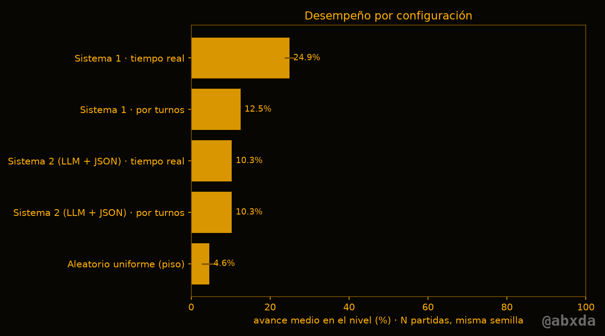
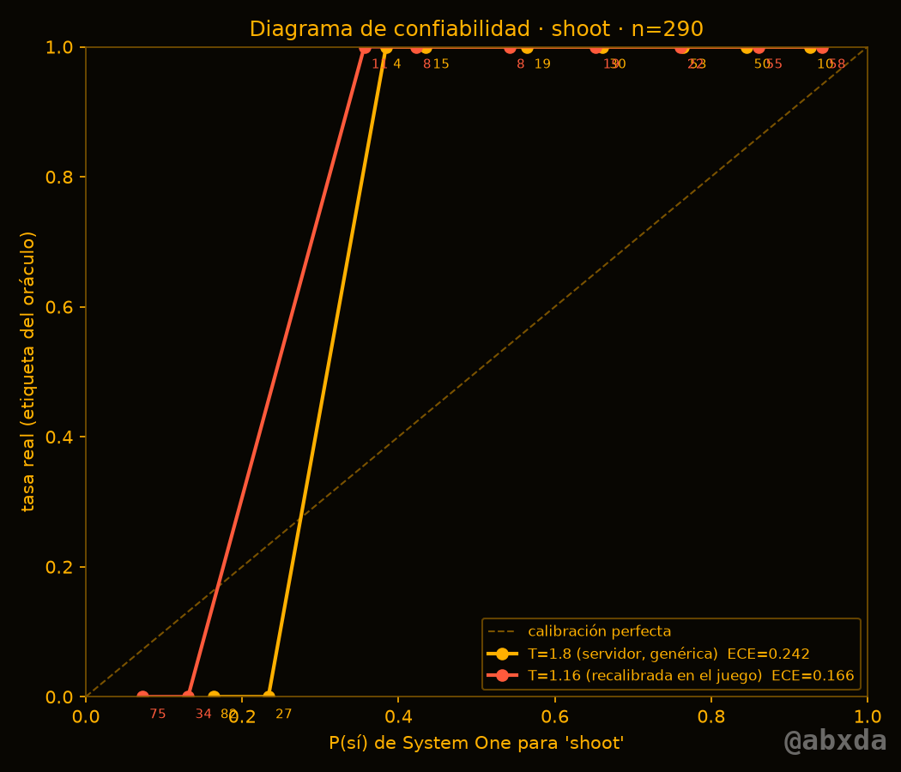
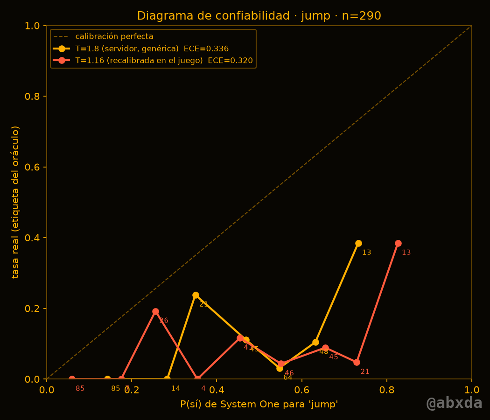
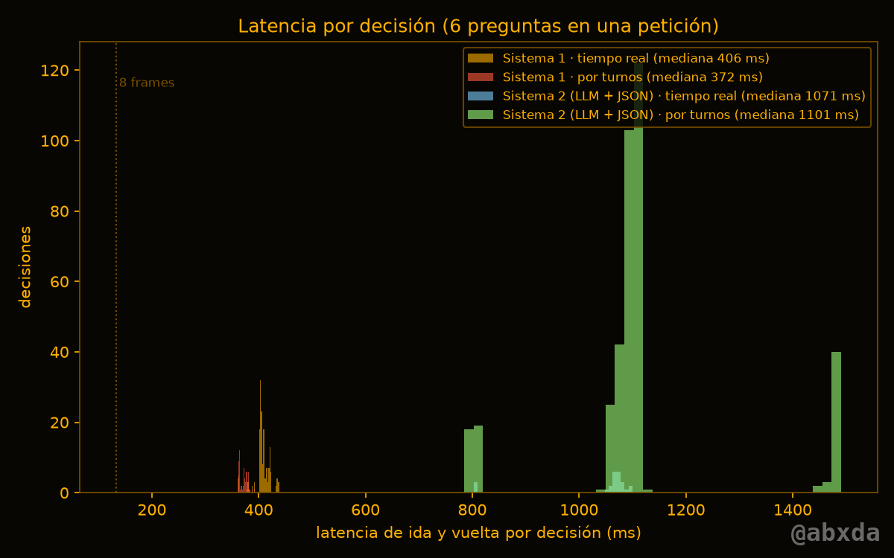

# Sistema 1 juega — resultados

*Ámbar Reflex, run-and-gun original de 8 bits jugado por decisiones tipadas (API compatible con Jev). Todas las cifras salen de `runs/` y `results.json`.* — @abxda

## Resumen

- En **tiempo real**, System One (Qwen3.5-4B local, 6 preguntas por petición) llegó en promedio al **24.9 %** del nivel (máximo 27.3 %), con **408 ms** de latencia media por decisión (p95 435 ms): una decisión cada 25 frames. Ninguna partida pasó del 27.3 % del nivel.
- **Por turnos** (el juego espera cada respuesta) llegó solo al **12.5 %**, menos que en tiempo real. La causa es un sesgo medible: P(saltar) ronda 0.55 aun sin amenazas y, decidiendo cada 8 frames, el soldado salta en la mayoría de las decisiones hacia el peligro. En tiempo real decide cada ~25 frames y salta menos. La recalibración por temperatura no corrige un sesgo; hacen falta umbrales por pregunta.
- El agente **aleatorio** (piso) llegó al 4.6 %.
- **Sistema 2** (qwen3.5:4b generando JSON con las mismas preguntas) tardó **1041 ms** por decisión (65 frames), 29.0 tokens generados de media y 0.0 % de JSON inválido (el modo JSON de Ollama funcionó bien). Llegó al 10.3 %: con la misma información, reaccionar 2.5× más lento cuesta más que cualquier ventaja de generar texto.
- La redacción importa más que el modelo: sin decir la meta, el agente se quedó quieto para siempre (punto muerto determinista), y medir `dy` desde los pies en vez de desde el arma hacía que apuntara mal.
- **El formato está garantizado; la corrección no**: 0 de 290 respuestas de System One fuera de esquema (validadas campo por campo contra el fixture), pero muchas decisiones equivocadas dentro del esquema (ver exactitud contra el oráculo).

## Configuración

- Servidor: `jevlocal` (Qwen3.5-4B GGUF Q8_0, llama.cpp CUDA) en RTX 3060 12 GB que también dibuja el escritorio; ctx 16k, 16 ramas, ubatch 512 (modo seguro), temperatura del servidor T=1.8.
- Semilla del nivel 1987; partidas en tiempo real N=5 (varían por el tiempo de llegada de cada respuesta). El modo por turnos es determinista: 2 réplicas idénticas lo verifican, más serían copias.
- Recalibración del juego: factor 1.55 sobre las probabilidades del servidor (T efectiva 1.16), ajustado con 348 etiquetas del oráculo en una partida separada (semilla 2024).
- Política v2: los umbrales se aplican a las preguntas que la API devuelve con `confidence` (mover y apuntar): > 0.9 ACTÚA, 0.5–0.9 DUDA (se ejecuta), < 0.5 FALLBACK (quieto; apuntar al frente y disparar). Las noul (saltar, agacharse, disparar) se ejecutan si P(sí) ≥ 0.5. La etiqueta de la decisión es la peor de mover/apuntar.

## Tabla comparativa

| Configuración | N | Avance medio % (±sd) | Máx % | Puntaje medio | Bajas | Muertes | Latencia media ms | p95 ms | Frames/decisión | Decisiones/s | % DUDA | % FALLBACK |
|---|--:|--:|--:|--:|--:|--:|--:|--:|--:|--:|--:|--:|
| Sistema 1 · tiempo real | 5 | 24.9 (±1.2) | 27.3 | 1530 | 11.6 | 3.0 | 408 | 435 | 25 | 1.96 | 62 | 32 |
| Sistema 1 · por turnos | 2 | 12.5 (±0.0) | 12.5 | 350 | 4.0 | 3.0 | 371 | 381 | — | — | 45 | 50 |
| Sistema 2 (LLM+JSON) · tiempo real | 3 | 10.3 (±0.0) | 10.3 | 67 | 0.7 | 3.0 | 1041 | 1092 | 65 | 0.75 | 0 | 0 |
| Sistema 2 (LLM+JSON) · por turnos | 1 | 10.3 (±0.0) | 10.3 | 1000 | 8.0 | 1.0 | 1112 | 1482 | — | — | 0 | 0 |
| Aleatorio uniforme | 5 | 4.6 (±2.0) | 6.8 | 260 | 2.6 | 2.4 | — | — | — | — | — | — |
| Humano (teclado) | 0 | pendiente (`make human`) | | | | | | | | | | |



## Variantes de redacción (selección por avance medio, N=3 en tiempo real)

| Variante | Qué cambia | Avance medio % | Latencia mediana ms | Tokens por petición |
|---|---|--:|--:|--:|
| A | literal de la especificación | 0.0 | 328 | 543 |
| B | geométrica, meta explícita, alturas de balas | 15.6 | 408 | 734 |
| C | B en inglés | 14.7 | 381 | 681 |
| D | B + compensación de latencia (dead reckoning) | 26.2 | 407 | 733 |

Elegida: **D**. La A se queda quieta desde el primer frame: sin la meta, el modelo prefiere 'quieto' (p≈0.50) y, como el estado nunca cambia, repite la misma respuesta hasta que la regla de estancamiento (45 s) termina la partida. La A además dice 'agacharse para esquivar un proyectil bajo', lo contrario de la física del juego (agacharse esquiva balas altas).

## Política v1 (descartada) — por qué

La primera política también exigía confianza a las preguntas noul, usando |2p − 1| (una extensión nuestra; la API no define `confidence` para noul). El modelo sí pedía saltar (p = 0.53–0.65 frente a hoyos y escalones), pero esa confianza quedaba bajo 0.5 y el agente no saltaba: caía en el hoyo o se quedaba para siempre frente a un escalón.

| Variante | Avance medio % con v1 | Partidas |
|---|--:|--:|
| A | 0.0 | 3 |
| B | 16.1 | 3 |
| C | 19.6 | 3 |
| D | 10.3 | 2 |

## Exactitud práctica contra el oráculo del simulador

El simulador es determinista, así que las etiquetas son exactas: `shoot` = hay un enemigo en pantalla; `jump`/`crouch` = hacerlo ahora evita un daño que sin hacerlo llegaría en 30 frames (rollout contrafactual); `aim` = dirección del enemigo alineado más cercano.

| Modo | shoot exactitud | jump exactitud (positivos) | jump recall | crouch exactitud (positivos) | aim exactitud (n) |
|---|--:|--:|--:|--:|--:|
| Sistema 1 · tiempo real | 0.971 | 0.676 (20) | 0.500 | 0.712 (26) | 0.864 (81) |
| Sistema 1 · por turnos | 0.883 | 0.433 (2) | 1.000 | 0.767 (2) | 0.444 (54) |

## Calibración aplicada

| Pregunta | n | positivos | ECE con T=1.8 (servidor) | ECE recalibrada para el juego |
|---|--:|--:|--:|--:|
| shoot | 290 | 181 | 0.242 | 0.166 |
| jump | 290 | 22 | 0.336 | 0.320 |

 

La T=1.8 del servidor es genérica (ajustada en 554 decisiones de texto, no de este juego). Recalibrar la temperatura con datos del juego mejora `shoot` (ECE 0.242 → 0.166) pero casi no `jump` (0.336 → 0.320): ahí el error es un sesgo (P(saltar)≈0.55 sin amenazas) que una temperatura no puede mover; hace falta un umbral o Platt por pregunta. Propuesta: recalibrar el servidor con datos del dominio usando `bin/jevlocal eval` sobre `runs/eval_rows_shoot.jsonl` (406 decisiones etiquetadas en el formato de jevlocal, con `--as-noul`).

## Latencia, lote y tokens



- Concurrencia (30 s): con 1 petición en vuelo, 1.99 decisiones/s y 410 ms; con 2 en vuelo, 2.43 decisiones/s y 722 ms. El servidor agrupa las dos peticiones en un lote, pero el cuello es de cómputo: sube la tasa a costa de decisiones más viejas.
- Tokens del `state` (variante D): mediana 81, p95 124, máximo 137 — muy por debajo del contexto seguro de 16k.
- Tokens del `state` (variante B): mediana 150, p95 155, máximo 157 — muy por debajo del contexto seguro de 16k.
- Tokens del `state` (variante A): mediana 59, p95 59, máximo 59 — muy por debajo del contexto seguro de 16k.
- Tokens del `state` (variante C): mediana 69, p95 94, máximo 94 — muy por debajo del contexto seguro de 16k.
- Tokens por petición completa (estado + 6 preguntas): mediana 725; el `state` usa 81, así que ~89 % es el texto de las preguntas: es la palanca real para bajar la latencia.
- 0 tokens generados: cada respuesta es una lectura de probabilidades en una pasada.

## La partida del video

`rt-D-1987-2` (la mejor de las 5 en tiempo real): avance 27 % (27.3 %), puntaje 1650, 12 bajas, 19.1 s de juego, 38 decisiones, latencia media 410 ms, p95 435 ms, FALLBACK 39 %. Son las cifras del cierre del video.

## Límites honestos

- El formato está garantizado; la corrección no.
- La latencia (~0.4 s con 6 preguntas en esta GPU en modo seguro) es lenta para un run-and-gun: en tiempo real el agente reacciona a un mundo que ya cambió.
- Un solo nivel, una semilla y un modelo de 4B; los resultados no generalizan a otros juegos sin medir.
- El oráculo define `shoot` como 'hay un enemigo en pantalla' porque el arma gira; la alineación exacta se reporta aparte.

## Reproducir

```bash
bench/server.sh start      # servidor System One (prerrequisito)
export JEV_BASE_URL=http://127.0.0.1:8765
make benchmark
```

— @abxda